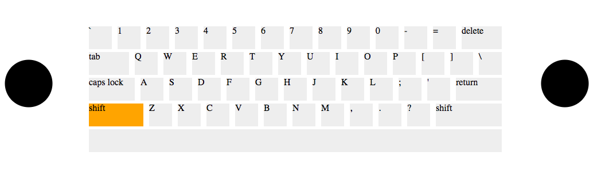

# Overview and Background

  SonoTouch is a music creation and visualization application centered around a user's keyboard input. Each keyboard key is associated with a different sound frequency and when a user presses a button, a visual and auditory representation of the pitch is rendered on scren. Users can combine keys in different durations and combinations to create their own unique music with just the touch of their keyboard! 

# MVP

  - Mechanical KeyBoard rendered on screen
  - There is one BoombBox speaker on each side of the keyboard
  - On a keydown press, the key on the keyboard lights up and a frequency is played
  - The frequency is visualized from the boombox speakers
  - Keys hit on the left side of the keyboard cause the left boombox to visualize, keys hit on the right cause the right boombox to visualize

 #### BONUS

  - Users can record and save musi 
  - Can overlap multiple audio waveforms to create a musical compositions

# Tech Used

  - D3.js
    - Used to visualize the pitch frequency. Color is respective to visible light spectrum. Frequencies normalized against wavelength 700-400nm
  - Web Audio API
    - Create an audio event for each pitch frequency. Map the frequency data to D3.js visualization

# Wireframe

# Implementation Timeline

  Day 1
    
    
    - [ ] Get Keyboard rendering on screen
    - [ ] Show BoomBox speaker on left and right

  Day 2

    - [ ] Create Audio objects for each frequency
    - [ ] Add event handlers to Keyboard to invoke sound playing

  Day 3

    - [ ] Bind sound data to D3.js 
    - [ ] Create vertical color visualization of sound

  Day 4

    - [ ] Cause sound visualization to come from speakers
    - [ ] Touch up CSS

  Day 5

    - [ ] Clean up CSS
    - [ ] Production ReadME

